BingoEvent -Käyttöopas 

Osa 1: Järjestelmänvalvojan opas (Admin) 

Järjestelmänvalvojan hallintapaneeli on Bingo-tapahtumien luomisen ja hallinnan keskus. Täällä voit suunnitella bingo-ruudukkoja, luoda tietovisoja, muokata tervetulosivuja ja seurata vieraiden antamaa palautetta. 

1. Aloittaminen: Kirjautuminen 

Pääset hallintapaneeliin navigoimalla IT-osastosi antamaan ylläpito-osoitteeseen. 

Syötä Käyttäjätunnus ja Salasana. 

Huom: Oletustunnukset ovat usein admin / admin123. 

Napsauta Login (Kirjaudu). 

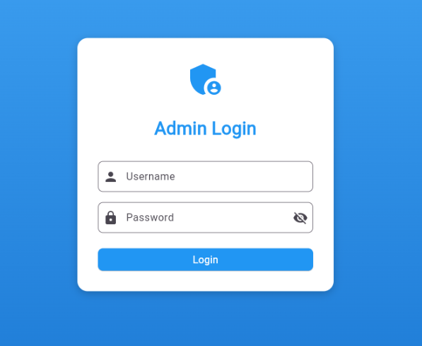

2. Hallintapaneelin yleisnäkymä 

Kirjautumisen jälkeen näet useita välilehtiä näytön yläreunassa. Jokainen välilehti hallitsee tiettyä osaa tapahtumasta. 

-Events (Tapahtumat): "Ohjauskeskus", jossa yhdistät kaiken sisällön yhdeksi paketiksi ja julkaiset sen. 
-Welcome Pages (Tervetulosivut): Muokkaa otsikoita ja alaotsikoita, jotka vieraat näkevät liittyessään peliin. 
-Bingo Boards (Bingo-ruudukot): Suunnittele 5x5-ruudukko ja jokaisen ruudun teksti. 
-Question Packages (Kysymyspaketit): Luo kysymyssarjoja "Tietovisa-haastetta" varten. 
-Mini-Games (Minipelit): Tarkastele ja ota käyttöön tapahtumaan kuuluvia pelejä. 
-Feedback (Palaute): Katso vieraiden antamia arvioita kokemuksestaan. 
-Admin Accounts (Ylläpitotunnukset): (Vain pääkäyttäjä) Luo tai hallinnoi muita järjestelmänvalvojia. 

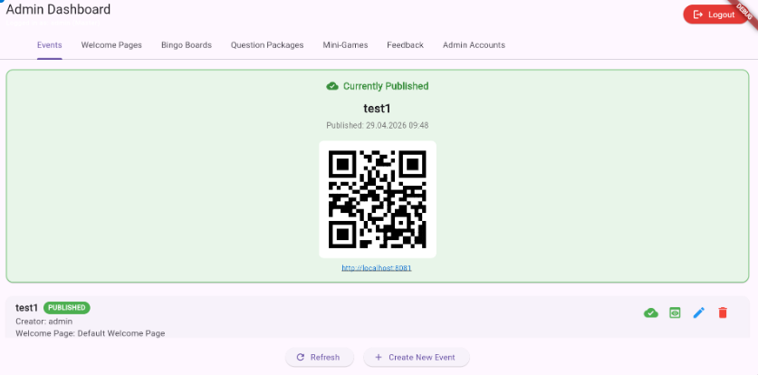

3. Ensimmäisen tapahtuman luominen (Työnkulku) 

Welcome Pages -välilehdellä luodaan ja muokataan tervetulosivuja, jotka vieraat näkevät ensimmäisenä pelisession alussa. 

-Mene Welcome Pages -välilehdelle. 
-Napsauta Create New Page (Luo uusi sivu) tai valitse olemassa oleva sivu muokattavaksi. 

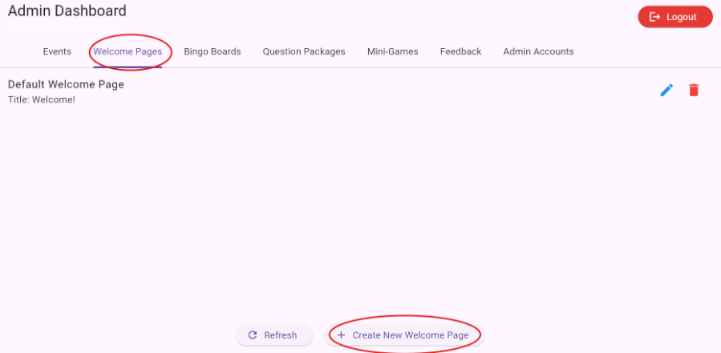

Täytä: 

Page Name (näkyy vain ylläpitäjällä) 

-Title (Otsikko) 
-Subtitle (Alaotsikko) 
-(Napsauta Preview (Esikatselu) nähdäksesi miltä sivu näyttää vieraille.) 
-Tallenna sivu. 

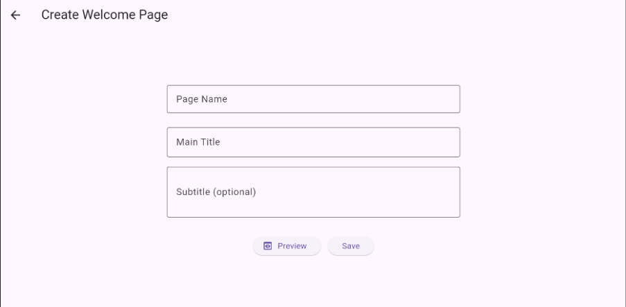

Kun olet luonut tervetulosivun, valitse se tapahtumaa luodessasi: 

Events → Create New Event 

Valitse pudotusvalikosta haluamasi Welcome Page 

 

Käynnistääksesi bingo-pelin, seuraa näitä vaiheita: 

Vaihe A: Suunnittele Bingo-ruudukko 

-Mene Bingo Boards -välilehdelle. 
-Napsauta Create New Board (Luo uusi ruudukko). 

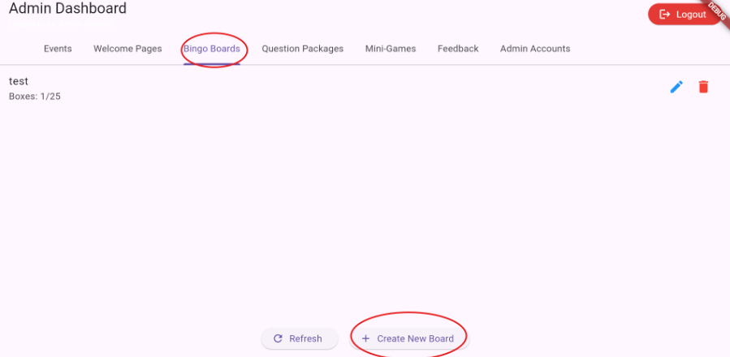

-Syötä Board Name (Ruudukon nimi). 
-Täytä 25 ruutua (5x5-ruudukko) teksteillä, joita haluat vieraiden etsivän. 
-(Napsauta Preview (Esikatselu) tarkistaaksesi ulkoasun)  
-Valitse sitten Save (Tallenna). 

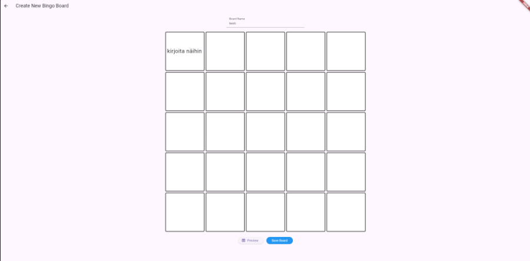

Vaihe B: Luo kysymyspaketti (Valinnainen) 

-Mene Question Packages -välilehdelle. 
-Napsauta Create New Package (Luo uusi paketti). 

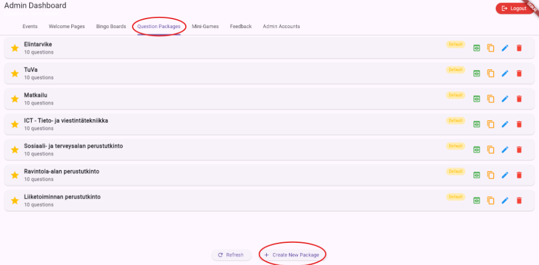

-Lisää vähintään 3 tietovisa-kysymystä. Anna jokaiselle kysymykselle 3 vastausvaihtoehtoa ja valitse oikea vastaus valintapainikkeella. 
-Napsauta Save Package (Tallenna paketti). 

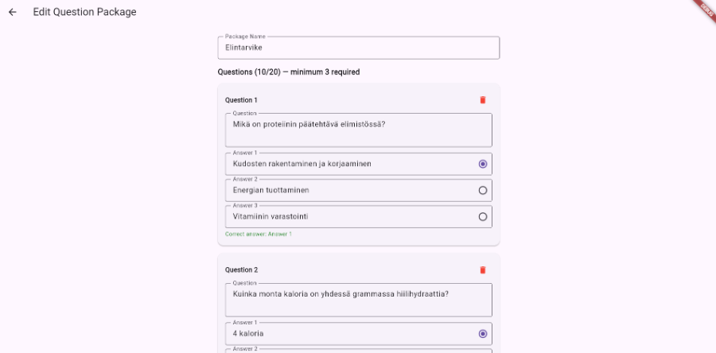

Vaihe C: Kokoa ja julkaise tapahtuma 

-Mene Events -välilehdelle. 
-Napsauta Create New Event (Luo uusi tapahtuma). 

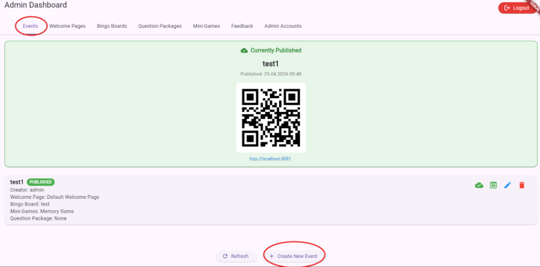

-Valitse haluamasi Tervetulosivu, Bingo-ruudukko ja Kysymyspaketti pudotusvalikoista. 
-Valitse Minipelit, jotka haluat sisällyttää mukaan. 
-Napsauta Save Event (Tallenna tapahtuma). 
-Etsi tapahtumasi listalta ja napsauta Pilvi/Julkaise-kuvaketta. 

Tärkeää: Vain yksi tapahtuma voi olla julkaistuna kerrallaan. 

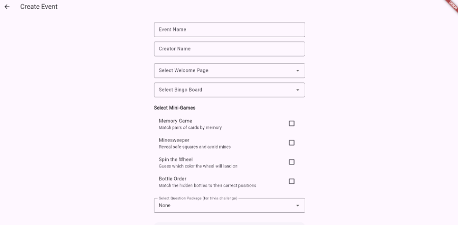

4. Vieraiden kutsuminen 

Kun tapahtuma on julkaistu, Events-välilehden yläosaan ilmestyy QR-koodi ja linkki. 

Vieraat voivat skannata koodin puhelimellaan liittyäkseen peliin. 

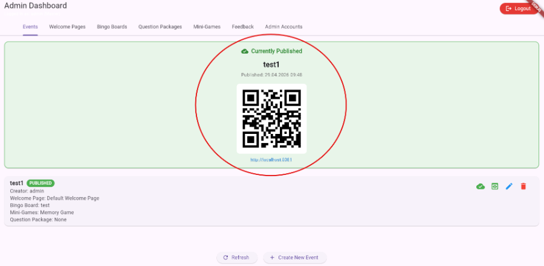

5. Palautteen tarkastelu 

Tapahtuman jälkeen vieraile Feedback-välilehdellä nähdäksesi listan arvioista (1–5 emojia) ja tapahtumista, joihin ne liittyvät. Tämä auttaa mittaamaan vieraiden tyytyväisyyttä. 

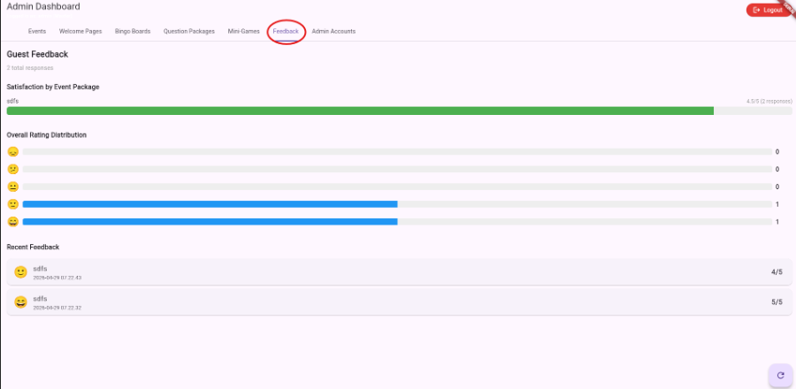

Admin Accounts (Ylläpitotunnukset) 

Admin Accounts -välilehti on tarkoitettu vain pääkäyttäjille (master). Täällä voit luoda, muokata ja poistaa muita ylläpitäjiä. 

-Mene Admin Accounts -välilehdelle. 
-Napsauta Create New Account (Luo uusi tili). 

Täytä: 

-Username (Käyttäjätunnus) 
-Password (Salasana) 
-Tallenna tili. 

Voit myös: 

-Napsauttaa olemassa olevaa tiliä muokataksesi salasanaa 
-Poistaa tilin, jos ylläpitäjä ei enää tarvitse käyttöoikeutta 

Huom: Vain master-käyttäjä voi luoda ja hallita muita ylläpitäjiä. Tavallinen ylläpitäjä ei näe tätä välilehteä. 

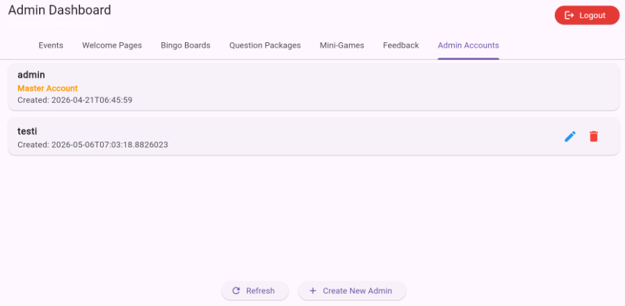

Osa 2: Vierasopas (Pelaaja) 

Tervetuloa Bingo-peliin! Tämä opas kertoo, miten pelaat ja voitat. 

1. Peliin liittyminen 

-Avaa älypuhelimesi kamera. 
-Skannaa järjestäjän tarjoama QR-koodi. 
-Peli avautuu puhelimesi selaimessa. Paina Continue (Jatka) tervetulosivulla. 

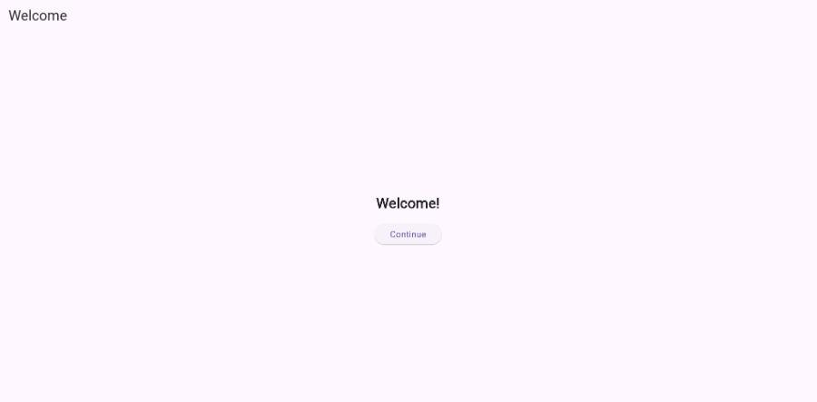

2. Kuinka pelata 

Tavoitteena on saada 5 merkinnän suora (vaaka-, pysty- tai vinorivi). 

Ruutujen merkitseminen: Kun löydät ruudukossasi olevan asian, napauta ruutua. Se muuttuu vihreäksi. 

3 ruudun haaste: Joka kerta kun merkitset 3 ruutua, sinulle esitetään haaste! 

-Tietovisa-haaste: Vastaa 3 kysymykseen oikein. 
-Minipeli: Pelaa nopea interaktiivinen peli ja voita. 

Palkinto: Jos voitat haasteen, saat Vapaavalintaisen merkinnän! Voit valita minkä tahansa ruudun ruudukostasi ja merkitä sen ilmaiseksi.

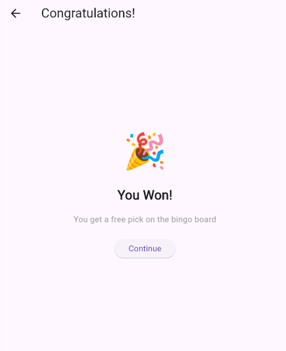
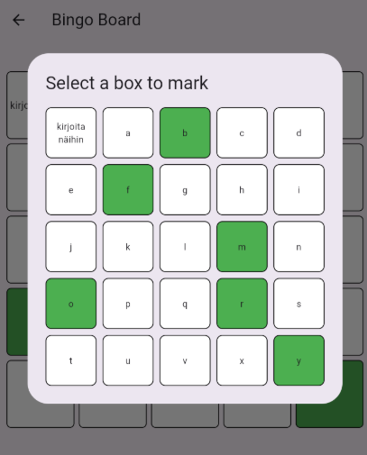

3. Voittaminen (Bingo!) 

Heti kun saat 5 ruudun suoran valmiiksi, näyttöön ilmestyy juhlanäkymä! 

Ruutuun tulee "Bingo!"-ilmoitus. 

Paina Continue (Jatka) antaaksesi palautetta. 

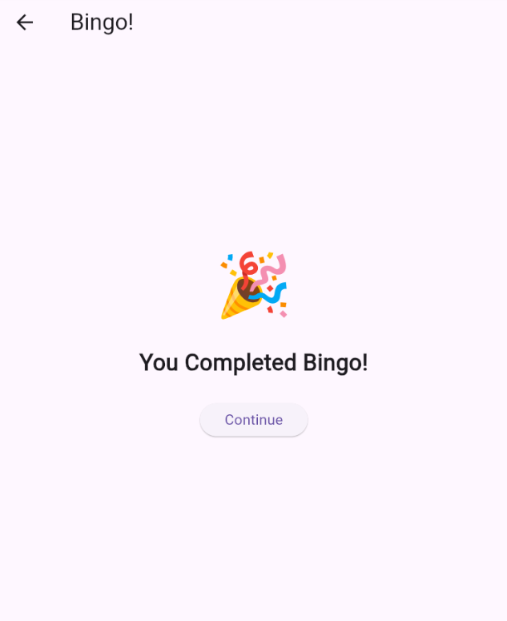

4. Palaute ja minipelit 

-Valitse emoji, joka parhaiten kuvaa kokemustasi. 
-Paina Submit Feedback (Lähetä palaute). 

Viimeisessä näkymässä voit halutessasi jatkaa Minipelien pelaamista odottaessasi tapahtuman päättymistä. 

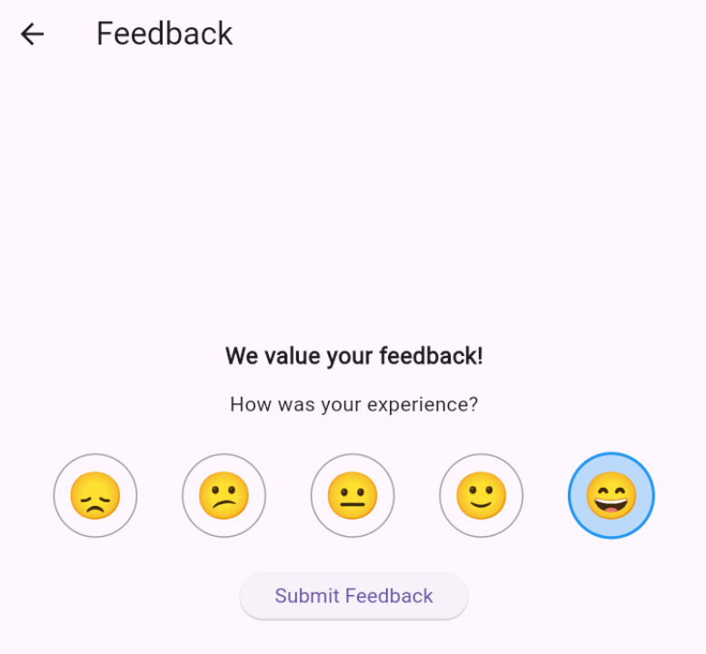

